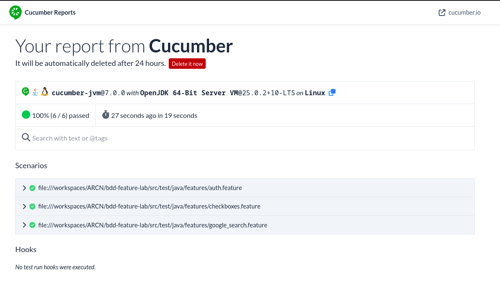
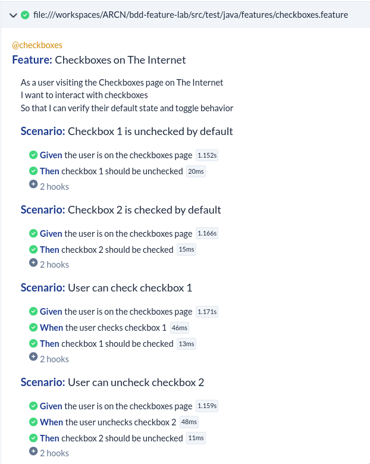

<div align="center">

## BDD Feature Laboratory - Selenium & Cucumber
Behavior Driven Development with Page Factory Pattern
By Andres Felipe Chavarro Plazas

</div>

<br>

## Description

This laboratory demonstrates Behavior Driven Development (BDD) using Cucumber and Selenium WebDriver, applied to real-world UI automation scenarios on [The Internet](https://the-internet.herokuapp.com/) — a practice site for web automation testing. The project follows the Page Object Model (POM) with the Page Factory pattern to structure test code in a maintainable and readable way.

<br>

## What is BDD?

Behavior Driven Development is a methodology that bridges the gap between business requirements and technical implementation. Tests are written first in plain English using the Gherkin syntax (Given / When / Then), before any production code exists.

### The BDD Flow

**1. Write the Feature** — describe the desired behavior in a `.feature` file using Gherkin. This becomes the single source of truth for what the system should do.

**2. Implement Step Definitions** — map each Gherkin step to a Java method. Steps interact with the application through Page Objects.

**3. Run and Verify** — Cucumber matches each scenario step to its definition and executes it. Failing tests drive the implementation forward.

### Why BDD?

- **Shared understanding**: scenarios are readable by developers, testers, and stakeholders alike
- **Living documentation**: feature files describe real system behavior, not hypothetical specs
- **Regression safety**: every scenario acts as a guard against future breakage

<br>

## What is Page Factory?

Page Factory is a Selenium mechanism for implementing the Page Object Model. Element locators are declared as annotated fields in the page class instead of scattered `findElement` calls throughout the steps:

```java
@FindBy(css = "form#checkboxes input:nth-of-type(1)")
WebElement checkbox1;
```

`PageFactory.initElements(driver, this)` is called once in the constructor and lazily resolves each field to the actual DOM element on first access. Locators stay centralized in one place, and step definitions never need to know anything about HTML structure.

<br>

## Project Structure

```
bdd-feature-lab/
├── src/
│   └── test/java/
│       ├── features/
│       │   ├── auth.feature            # Login scenarios
│       │   ├── google_search.feature   # Web search scenarios
│       │   └── checkboxes.feature      # Checkbox interaction scenarios
│       ├── pages/
│       │   ├── LoginPage.java          # Page Object for login form
│       │   └── CheckboxesPage.java     # Page Object for checkboxes
│       ├── runners/
│       │   └── TestRunner.java         # Cucumber JUnit runner
│       └── steps/
│           ├── LoginSteps.java         # Step definitions for auth feature
│           ├── SearchSteps.java        # Step definitions for search feature
│           └── CheckboxesSteps.java    # Step definitions for checkboxes feature
├── .devcontainer/
│   ├── devcontainer.json
│   └── Dockerfile
└── pom.xml
```

<br>

## Features Implemented

<br>

### 1. Form Authentication

Tests the login flow on The Internet using valid credentials. After submitting the form, the test verifies the redirect to the secure area and the presence of the success flash message.

**Files:** `auth.feature` / `LoginPage.java` / `LoginSteps.java`

<br>

### 2. Web Search

Tests basic search functionality using DuckDuckGo, which works reliably in headless environments without consent redirects. Validates that the results page contains the searched term.

**Files:** `google_search.feature` / `SearchSteps.java`

<br>

### 3. Checkboxes

Tests the default state and toggle behavior of checkboxes on The Internet. Covers four scenarios: default unchecked state, default checked state, checking an unchecked box, and unchecking a checked box.

**Files:** `checkboxes.feature` / `CheckboxesPage.java` / `CheckboxesSteps.java`

The hooks are scoped with a tag expression so the browser lifecycle only activates for checkboxes scenarios:

```java
@Before("@checkboxes")
public void setUp() { ... }

@After("@checkboxes")
public void tearDown() { driver.quit(); }
```

<br>

## Design Principles Applied

**SRP** — each class has one reason to change. `CheckboxesPage` locates and interacts with elements; `CheckboxesSteps` translates Gherkin into method calls. Neither knows about the other's internals.

**OCP** — adding a new scenario requires writing a new `.feature` scenario and at most one new step method. No existing class is modified.

**DRY** — locators live exclusively in the page object. Driver configuration is written once in `setUp()` and reused across all scenarios of the same feature.

**KISS** — `CheckboxesPage` exposes exactly four methods because those are the only operations the scenarios require. No base classes, no factories, no reflection utilities.

**YAGNI** — nothing beyond what the current scenarios demand. No retry logic, no screenshot-on-failure, no configuration abstraction.

<br>

## Running the Tests

**Run all features:**
```bash
mvn test
```

**Run only the checkboxes feature:**
```bash
mvn test -Dcucumber.filter.tags="@checkboxes"
```

**Clean build and run:**
```bash
mvn clean test
```

<br>

## Test Reports

Cucumber generates reports after each execution. The published report is accessible via the URL printed in the console at the end of the test run.

<br>

### Report Overview



<br>

### Feature Report



<br>

## Technologies

- **Java 21**
- **Maven** — dependency management and build lifecycle
- **Selenium WebDriver 4.0.0** — browser automation
- **Cucumber 7.0.0** — BDD framework and Gherkin parser
- **JUnit 4** — test runner integration
- **ChromeDriver** — headless Chrome execution

<br>

## Requirements & Setup

> **Note**: This project includes a DevContainer configuration. Opening it in VS Code with the Dev Containers extension provides a ready-to-use environment with Java, Maven, Chrome, and ChromeDriver pre-installed — no manual setup required.

### Prerequisites (without DevContainer)
- Java 21
- Maven 3.x
- Google Chrome + ChromeDriver at `/usr/local/bin/chromedriver`

<br>

## License

This project is licensed under the GNU General Public License v3.0.
