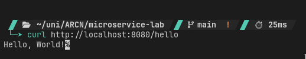
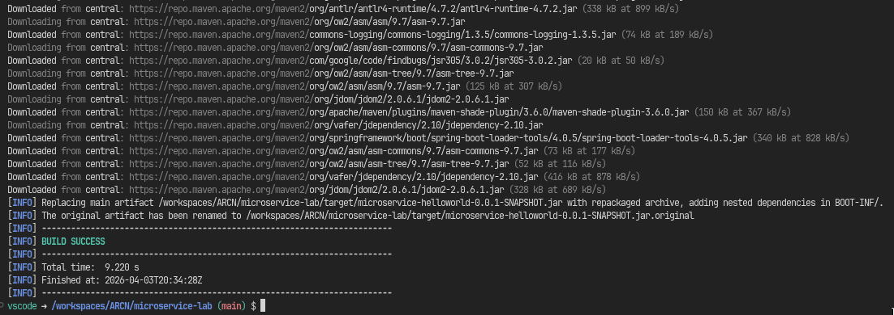
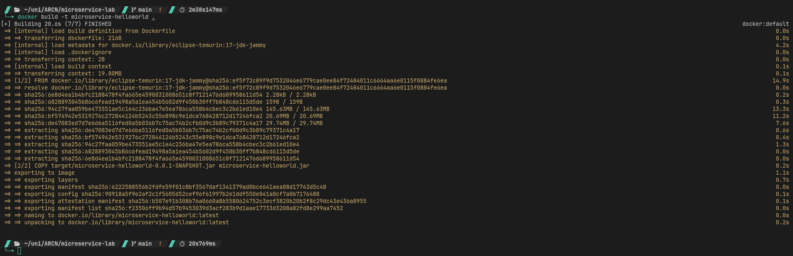
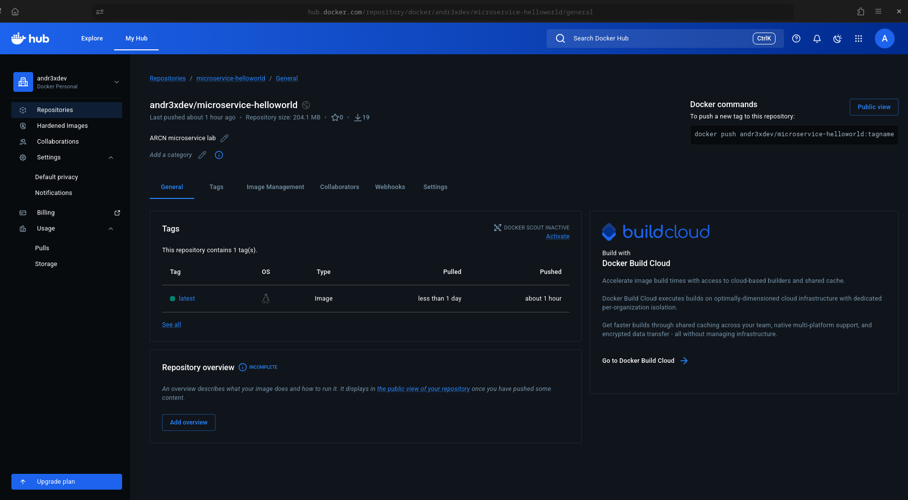
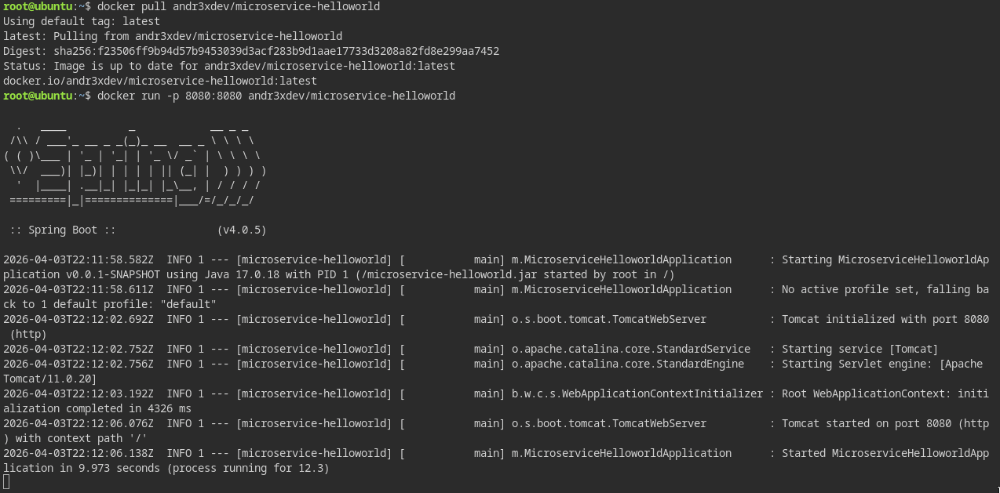
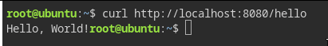

<div align="center">

## Microservice Lab - Hello World with Spring Boot & Docker
Building and deploying a containerized microservice
By Andres Felipe Chavarro Plazas

</div>

<br>

## Description

This laboratory demonstrates how to create, containerize, and deploy a minimal "Hello World" microservice using Spring Boot, Docker, and Play with Docker. The project starts from a Spring Initializr scaffold, adds a REST controller, packages the application into a Docker image, and runs it in a cloud environment via Play with Docker.

<br>

## What is a Microservice?

A microservice is a small, independently deployable service that does one thing well and exposes its functionality through a well-defined interface — typically a REST API. Unlike monoliths, microservices can be built, deployed, and scaled independently.

### Key Characteristics

- **Single responsibility**: each service handles one bounded domain
- **Independent deployment**: containerization allows each service to run in isolation
- **Lightweight communication**: services talk over HTTP/REST or messaging queues
- **Horizontal scalability**: individual services can be scaled without affecting others

<br>

## What is Spring Boot?

Spring Boot is a Java framework that simplifies building production-ready applications by providing:

- **Auto-configuration**: sensible defaults that eliminate boilerplate XML/config
- **Embedded server**: ships with an embedded Tomcat, so no separate server install is needed
- **Starter dependencies**: curated dependency sets (e.g. `spring-boot-starter-web`) that work together out of the box
- **Spring Initializr**: a web-based project generator that scaffolds a ready-to-run project

<br>

## Project Structure

```
microservice-lab/
├── .devcontainer/
│   └── devcontainer.json           # GitHub Codespaces / Dev Container config
├── src/
│   ├── main/
│   │   ├── java/microservice_helloworld/
│   │   │   ├── MicroserviceHelloworldApplication.java   # Entry point
│   │   │   └── HelloWorldController.java                # REST controller
│   │   └── resources/
│   │       └── application.properties
│   └── test/
│       └── java/microservice_helloworld/
│           └── MicroserviceHelloworldApplicationTests.java
├── Dockerfile                      # Container image definition
├── pom.xml                         # Maven configuration
└── README.md
```

<br>

## REST Endpoint

The service exposes a single endpoint:

| Method | Path     | Response          |
|--------|----------|-------------------|
| GET    | `/hello` | `Hello, World!`   |

**Controller implementation:**

```java
@RestController
public class HelloWorldController {

    @GetMapping("/hello")
    public String hello() {
        return "Hello, World!";
    }
}
```

<br>

## Step-by-Step Walkthrough

<br>

### 1. Application Running Locally

Start the application with the Maven wrapper:

```bash
mvn spring-boot:run
```

Verify the endpoint responds:

```bash
curl http://localhost:8080/hello
```



<br>

### 2. Building the JAR

Package the application into an executable JAR:

```bash
mvn clean package
```

This produces `target/microservice-helloworld-0.0.1-SNAPSHOT.jar`.



<br>

### 3. Building the Docker Image

With the Dockerfile at the project root:

```dockerfile
FROM openjdk:17-jdk-slim
COPY target/microservice-helloworld-0.0.1-SNAPSHOT.jar microservice-helloworld.jar
ENTRYPOINT ["java", "-jar", "/microservice-helloworld.jar"]
```

Build the image:

```bash
docker build -t microservice-helloworld .
```



<br>

### 4. Running the Container Locally

Test the image before pushing:

```bash
docker run -p 8080:8080 microservice-helloworld
```

```bash
curl http://localhost:8080/hello
```


<br>

### 5. Pushing to Docker Hub

Tag the image with your Docker Hub username and push:

```bash
docker tag microservice-helloworld <tu-usuario>/microservice-helloworld
docker logout
docker login -u <tu-usuario>
docker push <tu-usuario>/microservice-helloworld
```

> **Note:** `docker logout` is required first when working inside GitHub Codespaces, which pre-authenticates with its own registry.



<br>

### 6. Running on Killercoda

> **Note:** Play with Docker has been deprecated. [Killercoda](https://killercoda.com/) is used instead as the cloud Docker playground.

On Killercoda, open a Ubuntu scenario that includes Docker. Pull and run the image from Docker Hub in **Terminal 1**:

```bash
docker run -p 8080:8080 <tu-usuario>/microservice-helloworld
```

Leave that terminal running (the server blocks it). Open a **second terminal** and verify the endpoint:

```bash
curl http://localhost:8080/hello
```

You should receive `Hello, World!` as the response.




<br>

## Technologies

- **Java 17**
- **Spring Boot 4.0.5** — application framework with embedded Tomcat
- **Maven 3.9** — dependency management and build lifecycle
- **Docker** — containerization
- **Docker Hub** — public container registry
- **Killercoda** — ephemeral cloud Docker environment
- **JUnit 5** — test framework

<br>

## License

This project is licensed under the GNU General Public License v3.0.
